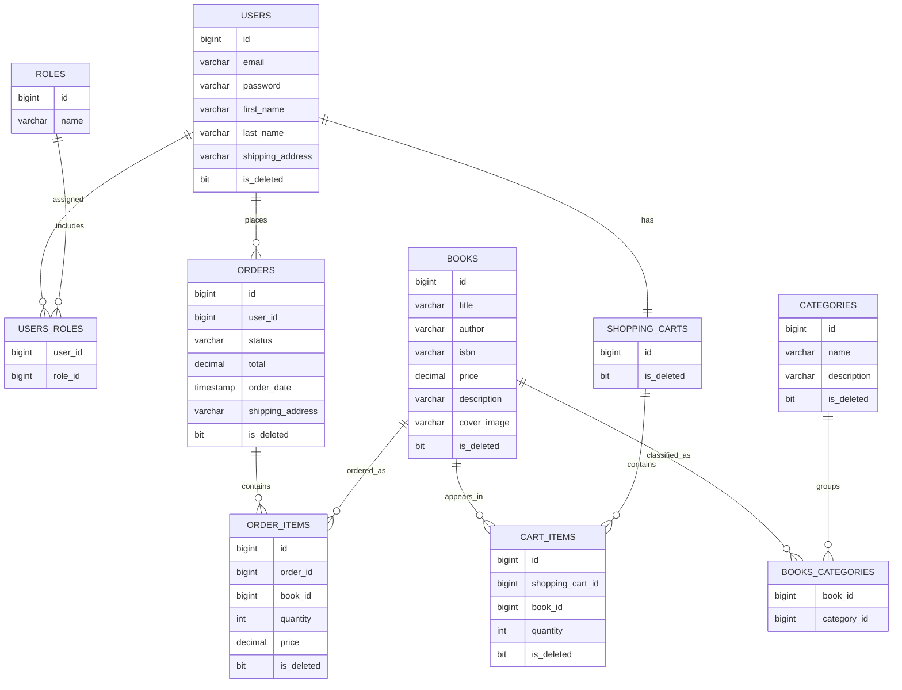

# Bookstore

Backend application for an online bookstore built with Java and Spring Boot.

## Table of contents
- [Project overview](#project-overview)
- [Technologies used](#technologies-used)
- [Features](#features)
- [Models and relations](#Models-and-relations)
- [Live demo](#live-demo)
- [Getting started](#getting-started)
- [Swagger](#swagger)
- [Project structure](#project-structure)
- [What I practiced](#what-i-practiced)
- [Contacts](#contacts)

## Project overview
This project provides a REST API for managing books, categories, shopping carts, and orders.  
It includes authentication and authorization, database migrations, API documentation, Docker support, and AWS deployment.

## Technologies used
- Java 17
- Spring Boot 3.4.1
- MySQL 8.0.33
- Spring Security
- Spring Data JPA
- Liquibase
- Swagger / OpenAPI
- Docker
- Maven
- MapStruct
- Lombok
- Testcontainers
- AWS EC2

## Features
- User registration and authentication
- Role-based access control
- Book and category management
- Shopping cart management
- Order creation and tracking
- API documentation with Swagger UI

## Models and relations



## Live demo
The application is deployed on AWS EC2.

Swagger UI:  
http://ec2-54-175-210-234.compute-1.amazonaws.com/swagger-ui/index.html

## Getting started

### 1. Clone the repository

[GitHub repository](https://github.com/SwtLouisiana/Bookstore)

```bash
git clone https://github.com/SwtLouisiana/Bookstore.git
cd Bookstore
```


### 2. Create an `.env` file
Create an `.env` file with the required environment variables. Use `.env.sample` as an example.

### 3. Repackage the project
```bash
mvn clean package
```

### 4. Run with Docker
```bash
docker-compose up --build
```

## Swagger
After starting the application locally, Swagger UI is available at:

http://localhost:8080/swagger-ui/index.html

## Project structure
- **config**
- **controller**
    - **AuthenticationController**
        - _POST_ `/api/auth/registration`
        - _POST_ `/api/auth/login`
    - **BookController**
        - _POST_ `/api/books`
        - _PUT_ `/api/books/{id}`
        - _GET_ `/api/books`
        - _GET_ `/api/books/{id}`
        - _DELETE_ `/api/books/{id}`
        - _GET_ `/api/books/search`
    - **CategoryController**
        - _POST_ `/api/categories`
        - _PUT_ `/api/categories`
        - _GET_ `/api/categories`
        - _GET_ `/api/categories/{id}`
        - _DELETE_ `/api/categories/{id}`
        - _GET_ `/api/categories/{id}/books`
    - **OrderController**
        - _POST_ `/api/orders`
        - _GET_ `/api/orders`
        - _PATCH_ `/api/orders/{id}`
        - _GET_ `/api/orders/{orderId}/items`
        - _GET_ `/api/orders/{orderId}/items/{itemId}`
    - **ShoppingCartController**
        - _GET_ `/api/cart`
        - _POST_ `/api/cart`
        - _PUT_ `/api/cart/cart-items/{cartItemId}`
        - _DELETE_ `/api/cart/cart-items/{cartItemId}`
- **dto**
- **exception**
- **mapper**
- **model**
- **repository**
- **security**
- **service**
- **validation**

## What I practiced
- building REST APIs
- securing endpoints with Spring Security
- working with relational databases
- managing migrations with Liquibase
- documenting APIs with Swagger
- containerizing applications with Docker
- deploying backend applications to AWS EC2

## Contacts
Created by [Pavlo Sukhanko](https://github.com/SwtLouisiana)